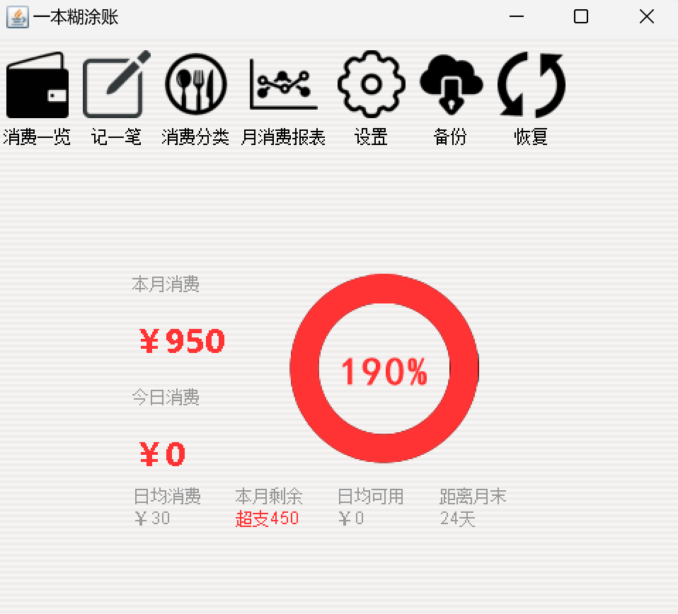
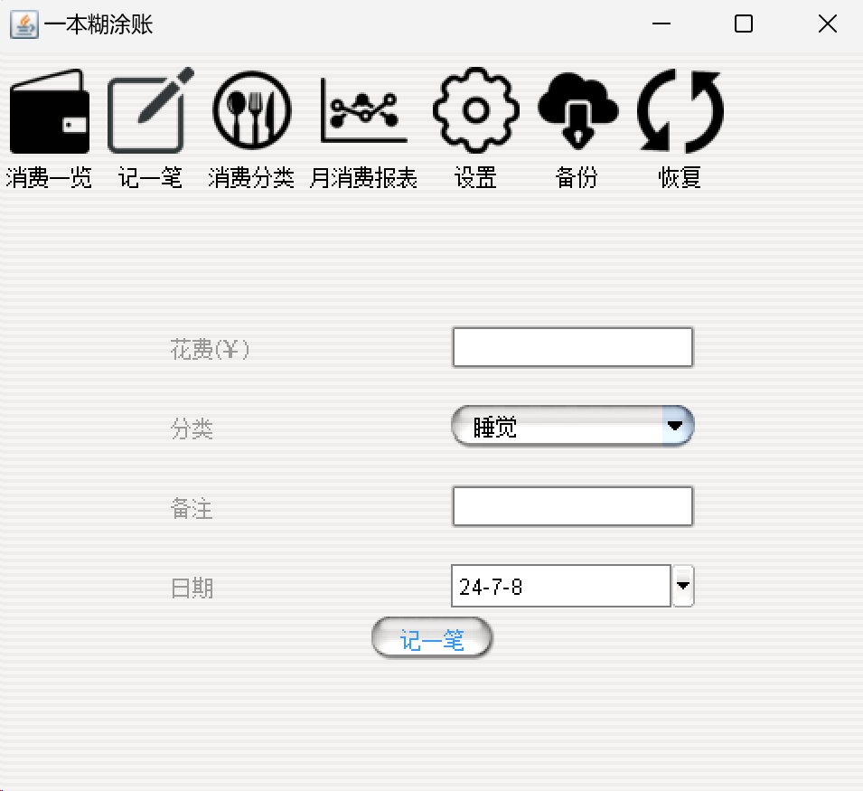
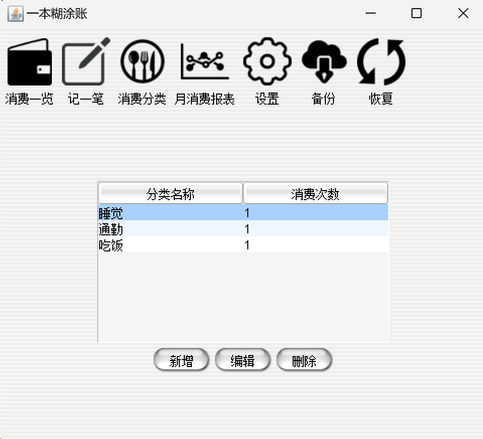
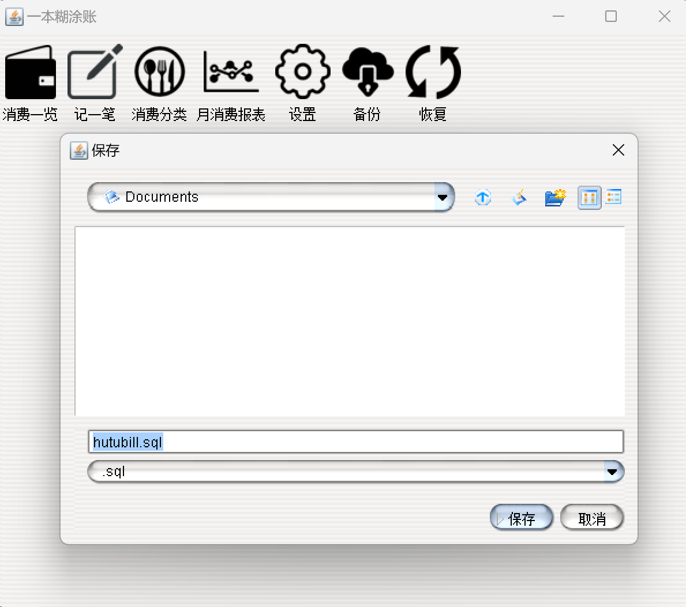
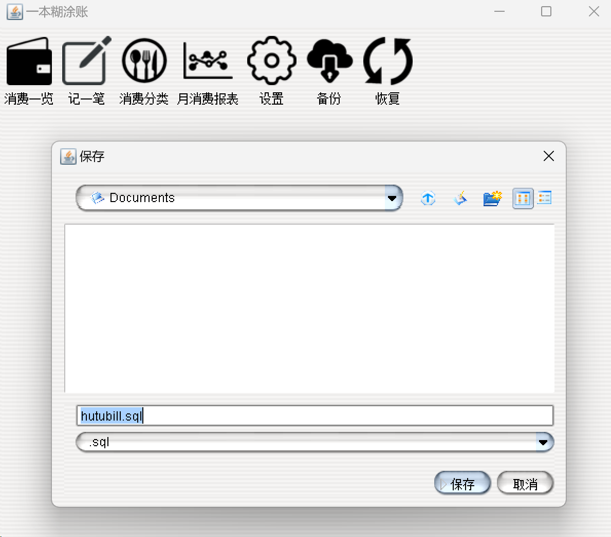
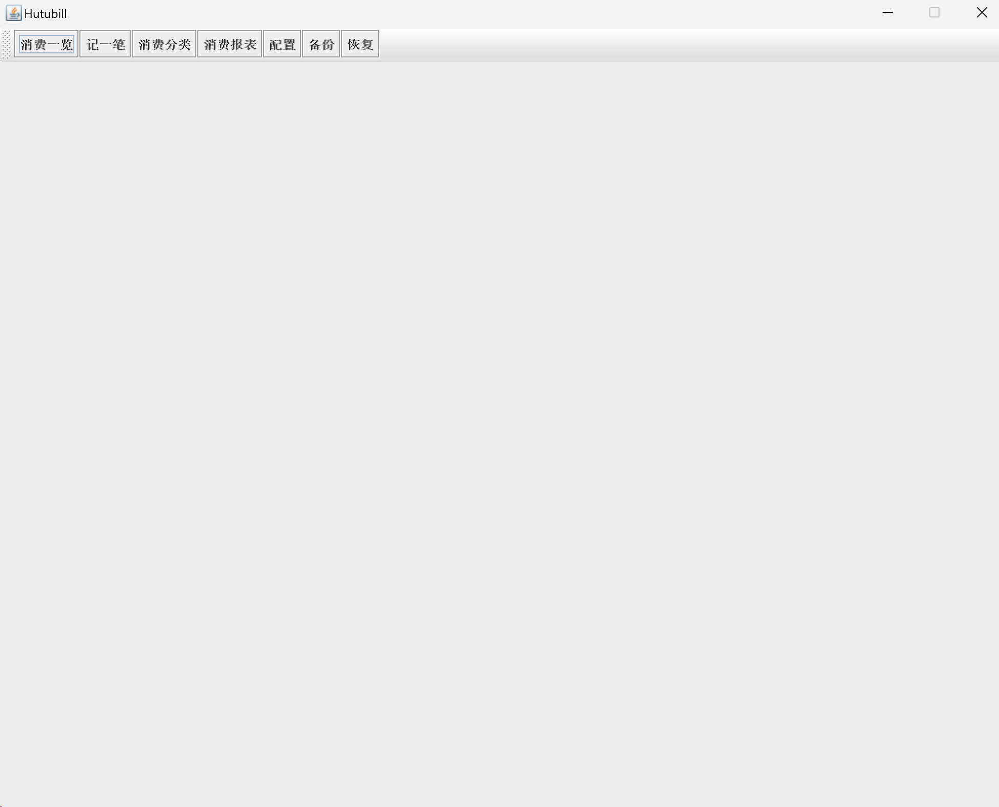
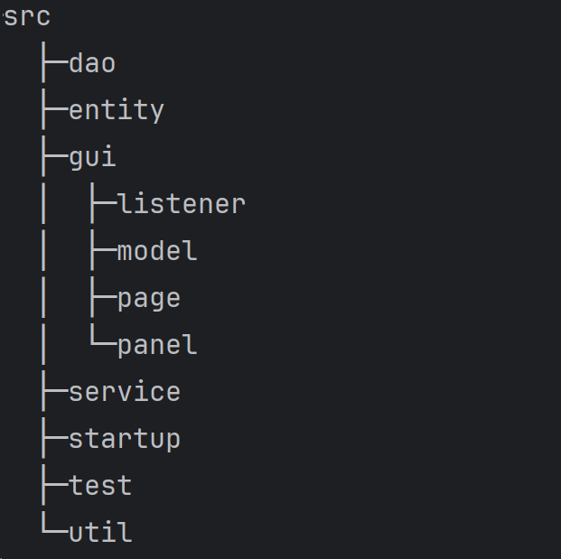
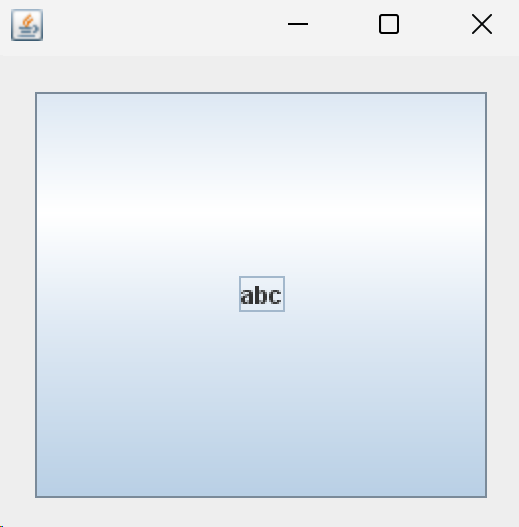

本项目开发为参考 `how2j.com` 一本糊涂账，只用于刚接触Java基本语法总结学习。

用时5天从配置环境到跑通代码，再到复现总结分析，全过程略为草率，对于整个业务和实现逻辑有清晰认识，但很多细节API还没有完全理解。

> 参考：
>
> [how2j.com 爬虫盗版](https://gitee.com/OpenDocCN/HOW2J-tuts/tree/master)
>
> [eupb阅读器](https://calibre-ebook.com/download_windows)
>
> [chenqwwq/Hutuzhang: http://how2j.cn/ 上的一本糊涂账实现项目 (github.com)](https://github.com/chenqwwq/Hutuzhang/tree/master)

# 0. 项目展示











# 1. 开发流程

- 表结构设计
  - 把表有哪些字段搞清楚，表与表之间的关系理顺。
  - 同时还要校验这样的表结构，是否能够支撑功能上的需要。
- 原型设计
  - 先把界面做出来，有了界面，才能**更有效的和客户沟通**，哪些功能需要修改，哪些功能可以删减。
  - 分两个部分来讲解，一个是原型-基础，一个是原型-界面类。
    - 在**原型-基础**章节，会从最粗简的方式开始，然后演示如何**从粗陋的直接new JFrame**逐步**演化**到面板分离，监听器分离，模型分离，并且讲解**为什么要这样做**和**这样做带来的好处。**，并重构出各种工具类，供后续界面设计重用。
    - 在**原型-界面类**章节，使用原型-基础中的设计思想，运用其中的工具类，把本项目设计到的各种界面原型，一一开发出来。
- 实体类与DAO的设计
  - 设计实体类与DAO。相关的数据库操作，都经由DAO来完成。
- 功能开发
  - 首先是确定**多层结构**，基于事件驱动，规划DAO层，Service层。 
  - 接着确定开发顺序
  - 最后引用第三方包

# 2. 表结构设计

设计过程分为**数据库和表的创建**、**表关系**、**约束**三个步骤。

## 01 创建数据库与表

1. 配置表信息 config

   用于**保存每月预算**和Mysql的安装路径（用于备份还原用）

   **id** 主键，每个表都有一个主键 类型是 int
   **key_** 配置信息按照键值对的形式出现 ，类型是varchar(255)
   **value**配置信息的值, 类型是 varchar(255)

2. 消费分类表 category

   用于**保存消费分类**，比如餐饮，交通，住宿。

   **id** 主键，每个表都有一个主键 类型是 int
   **name**分类的名称，类型是varchar(255)

3. 消费记录表 record

   用于**存放每一笔的消费记录**，并且会用到消费分类。

   **id** 主键，每个表都有一个主键 类型是 int
   **spend** 本次花费，类型是int
   **cid** 对应的消费分类表的中记录的id, 类型是int
   **comment** 备注，比如分类是娱乐，但是你希望记录更详细的内容，啪啪啪，那么就存放在这里。
   **date** 日期，本次记录发生的时间。

## 02 分析表之间的关系

一条记录数据对应一种分类，一条分类数据对应多条记录数据。

确定好分类和记录之间的关系之后，就需要在数据库表结构中**通过外键**表现出来，外键是加在多表中的，也就是加在Record表中的，在这里就是cid，cid指向category表的主键id。

## 03 约束

所有的表都有一个主键id，但是这只是语意上的(我们认为的)，为了让数据库把id**识别为主键**，需要加上主键约束。

设置id为自增长是常用的插入数据策略。 换句话说，插入消费分类数据的时候，只用提供分类名称即可，不需要自己提供id， id由数据库自己生成。

外键约束的作用是保持数据的一致性。

```mysql
# 添加主键
alter table config add constraint pk_config_id p
rimary key (id);

# 设置自增长
alter table category change id id int auto_increment;

# 外键
alter table record add constraint fk_record_category foreign key (cid) references category(id)
```

或者从创建表的时候就一次性创建

```mysql
create database hutubill;

use  hutubill;
 
CREATE TABLE config (
  id int AUTO_INCREMENT,
  key_ varchar(255) ,
  value varchar(255) ,
  PRIMARY KEY (id)
)  DEFAULT CHARSET=utf8;
 
CREATE TABLE category (
  id int AUTO_INCREMENT,
  name varchar(255) ,
  PRIMARY KEY (id)
)  DEFAULT CHARSET=utf8;
 
CREATE TABLE record (
  id int AUTO_INCREMENT,
  spend int,
  cid int,
  comment varchar(255) ,
  date Date,
  PRIMARY KEY (id),
  CONSTRAINT `fk_record_category` FOREIGN KEY (`cid`) REFERENCES `category` (`id`)
)  DEFAULT CHARSET=utf8;

```

至此，表结构设计的部分已完成。

# 3. 原型-基础

原型这个章节将从最粗陋的new JFrame开始做起，并分析其弊端。 然后逐一**演化和重构**出不同形式的开发界面的设计方法和思路，以及阐述这样设计带来的好处。

## 01 基础界面

**原型设计**

简单说，就是先把界面做出来。 界面上的数据，都是假数据，并不是从数据库中读取的真实数据。

**简陋的JFrame界面（后废除）**

最简单朴素的实现方式：通过JFrame直接实现界面，并给每个按键设置监听，缺点是代码冗余且难以维护。



```java
import javax.swing.*;
import java.awt.*;
import java.awt.event.ActionEvent;
import java.awt.event.ActionListener;

class HutuMainFrame {
    public static void main(String[] args) {
        JFrame f = new JFrame();

        // JFrame 的基本设置
        f.setSize(1000, 800);
        f.setTitle("Hutubill");
        f.setLocationRelativeTo(null); // 打开位于屏幕中间
        f.setResizable(false);
        f.setDefaultCloseOperation(JFrame.EXIT_ON_CLOSE);

        // 定义工具栏和按钮，并将按钮加入到工具栏当中
        JToolBar tb = new JToolBar();
        JButton bSpend = new JButton("消费一览");
        JButton bRecord = new JButton("记一笔");
        JButton bCategory = new JButton("消费分类");
        JButton bReport = new JButton("消费报表");
        JButton bConfig = new JButton("配置");
        JButton bBackup = new JButton("备份");
        JButton bRecover = new JButton("恢复");

        tb.add(bSpend);
        tb.add(bRecord);
        tb.add(bCategory);
        tb.add(bReport);
        tb.add(bConfig);
        tb.add(bBackup);
        tb.add(bRecover);

        // 设置布局
        f.setLayout(new BorderLayout());
        f.add(tb, BorderLayout.NORTH);
        f.add(new JPanel(), BorderLayout.CENTER);

        f.setVisible(true); // 显示GUI组件


        // 设置事件监听
        bSpend.addActionListener(new ActionListener() {
            public void actionPerformed(ActionEvent e) {

            }
        });

        bRecord.addActionListener(new ActionListener() {
            public void actionPerformed(ActionEvent e) {

            }
        });

        bCategory.addActionListener(new ActionListener() {
            public void actionPerformed(ActionEvent e) {

            }
        });

        bReport.addActionListener(new ActionListener() {
            public void actionPerformed(ActionEvent e) {

            }
        });

        bConfig.addActionListener(new ActionListener() {
            public void actionPerformed(ActionEvent e) {

            }
        });

        bBackup.addActionListener(new ActionListener() {
            public void actionPerformed(ActionEvent e) {

            }
        });

        bRecover.addActionListener(new ActionListener() {
            public void actionPerformed(ActionEvent e) {

            }
        });
    }
}
```

## 02 界面包（gui）的规划



- page
  - 主框架
- panel
  - 界面文件
- listener
  - 所有的监听器都做成独立的类，实现ActionListener接口
- model
  - 用于存放数据，在这个项目中会用到TableModel和ComboBoxModel。


## 02 单例的面板类

在本项目中，各种按钮监听器的主要作用是获取组件的值，和修改组件的值。

那么如何使得监听器可以方便得获取组件呢？ 这就需要用到两个设计手段

1. 在面板类中，把组件声明为`public`的属性

   ```java
   public class SpendPanel{}
   ```

2. 把面板类设计为`单例模式`

   ```java
   public static SpendPanel instance = new SpendPanel();
   ```

3. 监听器通过单例模式的面板访问组件

   需要说明的一点是，`report`和`spend`页面无交互设计，因此未设计监听器。


## 04 居中面板 CentrePanel




## 05 GUIUtil

在开发图形界面的过程中，有很多功能在各个地方都会用到，并且重复使用的概率比较高。 比如判断一个输入框是否是数字，是否是空，是否为0等等类似的，所以把这些使用比较普遍的功能，抽象到一个工具类里。 这样以后再用的时候，就直接调用就可以了，而不需要每次都单独再写一遍。

# 4. 原型-界面类

画界面都大同小异，CRUD工作。

## 01 SpendPanel

**布局分析**

整体采用`BorderLayout`，中间是一个`panel`采用`BorderLayout.CENTER`，下面也是一个`panel`采用`BorderLayout.South`

中间的`panel`再分为中西两部分，西边用的一个`GridLayout`，4行1列，中间返回环形进度条。

南边设置2列4行的`GridLayout`。


# 5. 实体类和DAO

## 01 实体类Entity

实体类Entity是用于映射表中的一条一条数据的。比如分类表Category，有很多条分类记录，那么就有一个类也叫做Category，这个类的一个一个的实例，就对应了表Category中的一条一条的记录。

## 02 DBUtil

> 记得导入jar包 mysql-connector-java-5.0.8-bin.jar

```Java
package util;

import java.sql.Connection;
import java.sql.DriverManager;
import java.sql.SQLException;

public class DBUtil {
    //
    static String ip = "127.0.0.1";
    static int port = 3306;
    static String database = "hutubill";
    static String encoding = "UTF-8";
    static String loginName = "root";
    static String password = "admin";
    static{
        try {
            Class.forName("com.mysql.cj.jdbc.Driver");
        } catch (ClassNotFoundException e) {
            e.printStackTrace();
        }
    }

    public static Connection getConnection() throws SQLException {
        String url = String.format("jdbc:mysql://%s:%d/%s?serverTimezone=Asia/Shanghai&characterEncoding=%s&useSSL=false", ip, port, database, encoding);
        return DriverManager.getConnection(url, loginName, password);
    }
}
```

## 03 DateUtil

获取时间的方式真是千奇百怪。

# 7. 问题

## 01 CentrePanel.java

没有达到预定的效果，感觉是创建了一个模块，但是没有把组件成功加入到布局当中。

## 02 MysqlUtil.java

在 JDBC URL 中，参数应该使用 `&` 符号进行连接，而不是 `?` 符号。此外，如果有多个参数，应该按照正确的格式进行拼接。

```java
public static Connection getConnection() throws SQLException {
    String url = String.format("jdbc:mysql://%s:%d/%s?serverTimezone=Asia/Shanghai&characterEncoding=%s", ip, port, database, encoding);
    return DriverManager.getConnection(url, loginName, password);
}
```

[解决Loading class `'com.mysql.jdbc.Driver'. This is deprecated. The new driver class is 'com.mysql.cj.jdbc.Driver'.`](https://www.cnblogs.com/baby123/p/10436710.html)

```java
try {
    Class.forName("com.mysql.cj.jdbc.Driver");
} catch (ClassNotFoundException e) {
	e.printStackTrace();
}
```
